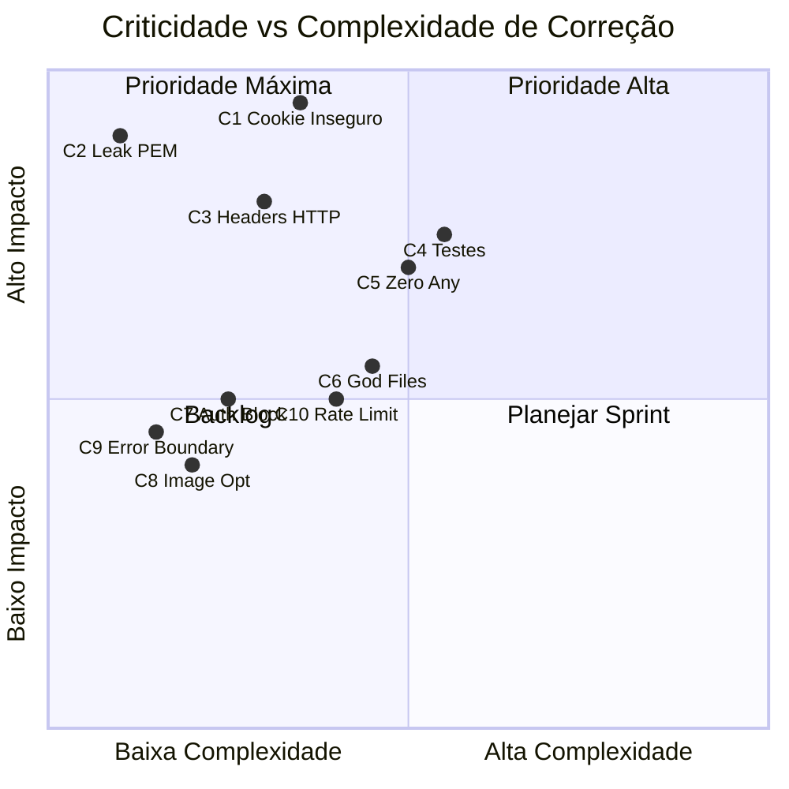

# 🔬 Auditoria Técnica — BPlen HUB v3

> **Escopo:** Governança, Segurança, Design System, Arquitetura, Infraestrutura, Escalabilidade e Performance  
> **Data:** 16/04/2026  
> **Codebase:** ~170+ arquivos · Next.js 16 + Firebase + Google Workspace

---

## 1. Pontos Fortes ✅

| Dimensão | Evidência |
|---|---|
| **Governança Documental** | Três marcos formais (`GOVERNANCE.md`, `FORMS_GLOBAL.md`, `SURVEY_GLOBAL.md`) com critérios claros de Definition of Done, pipeline de validação (`npm run check`) e classificação de ativos |
| **Sensor de Ambiente (Zod)** | Validação estrita de variáveis de ambiente em `env.ts` com schemas separados cliente/servidor — impede deploy com configuração incompleta |
| **Firestore Security Rules** | Modelo de soberania sólido: fallback deny-all, leitura por dono via `_AuthMap`, escrita exclusiva via Admin SDK |
| **Camada de Guards Server-Side** | `requireAdmin`, `requireMemberAccess`, `requireAuth` com suporte a banimento (`suspended`), auditoria de acesso e ID Token JWT |
| **Design System com Temas** | 7 temas consistentes via CSS custom properties, incluindo modo daltônico (alto contraste) — acessibilidade genuína |
| **Padrão Transacional** | Operações críticas (booking, quotas, matrícula) usam `runTransaction` no Firestore Admin SDK |
| **Espelhamento Drive/Sheets** | Mirror automático de dados para Google Workspace — resiliência operacional fora do Firebase |
| **Identidade Auto-Healing** | Triplo fallback de resolução de matrícula: AuthMap → UID Search → Email Search com auto-correção |
| **Singleton Firebase** | Tanto client (`getApps().length > 0`) quanto admin (`admin.apps.length > 0`) previnem inicialização duplicada |
| **Pipeline de Qualidade** | Script `check` unifica lint + test + type-check + build em sequência obrigatória |

---

## 2. Pontos Fracos ⚠️

| Dimensão | Evidência |
|---|---|
| **Violação da Política Zero-Any** | 100+ ocorrências de `any` espalhadas pelo codebase — ações, componentes, tipos. Contradiz diretamente o GOVERNANCE.md |
| **Cobertura de Testes Mínima** | Apenas 1 arquivo de teste (`governance.test.ts`, 45 linhas) — nenhuma action, nenhum componente, nenhum fluxo de autenticação testado |
| **Arquivos Monolíticos** | `calendar.ts` (1441 linhas / 55KB), `survey-effects.ts` (798 linhas / 35KB) — God Files com lógica de negócio, email, Drive tudo junto |
| **Cookie de Sessão é UID em plaintext** | O `bplen_session_uid` é o UID do Firebase cru no cookie — sem assinatura, sem HMAC, sem session token |
| **`next.config.ts` vazio** | Zero configuração: sem `images.remotePatterns`, sem `headers()` de segurança, sem CSP, sem rate-limiting |
| **Sem Rate Limiting** | Nenhuma proteção contra abuso nas Server Actions nem nas API Routes |
| **HTML Inline nos Emails** | Templates de email são strings de HTML inline dentro das actions, sem sanitização de XSS |
| **Log de PEM em Produção** | `env.ts` linha 44: loga prefixo da chave privada em produção — vazamento parcial de segredo |
| **Duplicação Massiva em survey-effects.ts** | Padrão Drive (ensureFolder → catFolder → userFolder → surveyFolder → createSpreadsheet) repetido 6× quase identicamente |
| **AuthProvider bloqueia render** | Linha 163: `{!loading && children}` — nada é renderizado até que auth + Firestore resolvam, inclusindo páginas públicas |
| **Sem Error Boundaries** | Nenhum React Error Boundary — crash em qualquer componente derruba toda a aplicação |
| **Sem Cache/Memoização** | Firestore queries repetidas sem cache, sem `React.memo`, sem `useMemo` em componentes pesados |

---

## 3. Top Criticidades 🚨

Ordenadas por severidade (do mais crítico para o menos):

---

### 🔴 C1 — Cookie de Sessão Inseguro (Severidade: CRÍTICA)

**O quê:** O `bplen_session_uid` armazena o UID do Firebase como valor literal do cookie. Qualquer pessoa que conheça o UID de um usuário pode forjar o cookie e obter acesso total à área logada, admin e member area.

**Onde:** [auth-session.ts](file:///d:/BPlen%20HUB/v3/src/actions/auth-session.ts#L27-L33) · [server-session.ts](file:///d:/BPlen%20HUB/v3/src/lib/server-session.ts#L34-L35) · [middleware.ts](file:///d:/BPlen%20HUB/v3/src/middleware.ts#L16)

**Impacto:** Escalação de privilegio. Um atacante pode acessar qualquer conta (incluindo admin) sem credenciais.

#### Propostas de Correção

| # | Proposta | Complexidade | Risco | Benefício |
|---|---|:---:|:---:|---|
| **A** | **Firebase Session Cookies**: Usar `admin.auth().createSessionCookie(idToken)` para gerar cookies assinados verificáveis via `verifySessionCookie()`. O middleware passa a validar criptograficamente. | 🟡 Média | 🟢 Baixo | **Elimina o vetor de ataque.** Cookie assinado, revogável, com tempo de expiração nativo. Padrão Google. |
| **B** | **Assinar o UID com HMAC-SHA256**: Manter a estrutura atual mas assinar o cookie com um segredo (`uid.signature`). Verificar no middleware. | 🟢 Baixa | 🟢 Baixo | Mitiga forja sem refatorar auth. Não tem revogação nativa. |
| **C** | **Passar ID Token via header em todas as chamadas**: Eliminar o cookie completamente e forçar o cliente a enviar `idToken` em cada Server Action. | 🔴 Alta | 🟡 Médio | Mais seguro, mas exige refatorar todas as Server Actions, perde SSR e aumenta latência (verificação JWT por chamada). |

> [!IMPORTANT]
> **Recomendação: Proposta A.** É o padrão oficial do Firebase, tem a melhor relação complexidade/benefício, e resolve o problema na raiz.

---

### 🔴 C2 — Vazamento Parcial de Chave Privada nos Logs (Severidade: CRÍTICA)

**O quê:** A função `normalizePrivateKey` em `env.ts` loga os primeiros 30 caracteres da PEM em produção.

**Onde:** [env.ts](file:///d:/BPlen%20HUB/v3/src/env.ts#L43-L45)

**Impacto:** Exposição parcial da chave de Service Account nos logs — atacante com acesso a Vercel logs pode reconstruir a chave.

#### Propostas de Correção

| # | Proposta | Complexidade | Risco | Benefício |
|---|---|:---:|:---:|---|
| **A** | **Remover o log completamente**. A validação Zod já garante presença. Para debug, logar apenas `Key Length: ${len} | Has Headers: true/false`. | 🟢 Trivial | 🟢 Zero | Elimina o vazamento. 1 linha de mudança. |
| **B** | Mover para log condicional `NODE_ENV === "development"` apenas. | 🟢 Trivial | 🟢 Zero | Mitiga em prod, mantém debug local. |
| **C** | Substituir por hash SHA-256 dos primeiros bytes para rastreio seguro. | 🟢 Baixa | 🟢 Zero | Permite auditoria sem exposição. |

> [!CAUTION]
> **Ação imediata necessária: Proposta A.** Deve ser corrigida no próximo deploy.

---

### 🔴 C3 — Ausência Total de Headers de Segurança HTTP (Severidade: ALTA)

**O quê:** Nenhum header de segurança HTTP configurado: sem CSP, sem X-Frame-Options, sem Strict-Transport-Security, sem X-Content-Type-Options.

**Onde:** [next.config.ts](file:///d:/BPlen%20HUB/v3/next.config.ts) — arquivo vazio

**Impacto:** Vulnerável a clickjacking, mime-sniffing, XSS via inline scripts e man-in-the-middle em subdomínios.

#### Propostas de Correção

| # | Proposta | Complexidade | Risco | Benefício |
|---|---|:---:|:---:|---|
| **A** | **Configurar `headers()` no `next.config.ts`** com CSP, HSTS, X-Frame-Options, X-Content-Type-Options, Referrer-Policy, Permissions-Policy. | 🟡 Média | 🟡 Médio (CSP pode quebrar inline styles/scripts) | Conformidade com OWASP Top 10. Proteção contra clickjacking e XSS. |
| **B** | Adicionar headers via `vercel.json` ao invés do Next config. | 🟢 Baixa | 🟢 Baixo | Mais simples, mas acoplado ao Vercel. |
| **C** | Implementar middleware de headers customizado no `middleware.ts` existente. | 🟢 Baixa | 🟢 Baixo | Funciona em qualquer host, mas roda em cada request. |

> [!IMPORTANT]
> **Recomendação: Proposta A**, complementada com B para headers estáticos.

---

### 🟠 C4 — Cobertura de Testes em ~0% (Severidade: ALTA)

**O quê:** Um único arquivo de teste com 2 suites superficiais. Nenhuma action, nenhum componente, nenhum fluxo de autenticação, nenhum guard testado. O `npm run test` do pipeline passa mas não testa praticamente nada.

**Onde:** [__tests__/governance.test.ts](file:///d:/BPlen%20HUB/v3/src/__tests__/governance.test.ts)

**Impacto:** Falsa sensação de segurança. Qualquer refatoração pode introduzir regressões silenciosas nos fluxos críticos de booking, identidade e permissões.

#### Propostas de Correção

| # | Proposta | Complexidade | Risco | Benefício |
|---|---|:---:|:---:|---|
| **A** | **Testes de integração para fluxos críticos primeiro**: Mock do Admin SDK e testar `resolveUserIdentity`, `bookEventAction`, `requireAdmin`, `syncUserPermissionsOnLogin`. Cobertura dos 5 fluxos de maior risco. | 🟡 Média | 🟢 Baixo | Alta confiança nos fluxos de identidade e booking. ROI máximo. |
| **B** | Adicionar testes de componentes com Testing Library para `AuthProvider`, `HubShell`, `SurveyEngine`. | 🟡 Média | 🟢 Baixo | Previne regressões de UI em fluxos complexos. |
| **C** | Implementar E2E com Playwright para cenários de login, booking e preenchimento de survey. | 🔴 Alta | 🟡 Médio (flaky tests com Firebase) | Gold standard, mas alto investimento inicial. |

> [!TIP]
> **Recomendação: Começar por A.** 80% do valor com 20% do esforço. Testar actions server-side é mais simples e de maior impacto.

---

### 🟠 C5 — Violação Sistemática da Política Zero-Any (Severidade: ALTA)

**O quê:** 100+ usos de `any` no codebase, concentrados em: `survey-effects.ts`, `SurveyEngine.tsx`, `calendar.ts`, `auth-permissions.ts`, `coupons.ts`, `checkout.ts`.

**Onde:** Codebase inteiro — especialmente `src/actions/` e `src/components/forms/`

**Impacto:** Contradiz o GOVERNANCE.md. Erros de tipo passam silenciosamente, bugs de runtime são possíveis em operações financeiras (checkout, quotas).

#### Propostas de Correção

| # | Proposta | Complexidade | Risco | Benefício |
|---|---|:---:|:---:|---|
| **A** | **Triage por zona**: Corrigir primeiro os `any` em `actions/` (servidor, dados financeiros). Usar `unknown` + type guards. Depois `components/`. | 🟡 Média | 🟢 Baixo | Elimina riscos de runtime nos fluxos de servidor. Alinha com Definition of Done. |
| **B** | Ativar `"noImplicitAny": true` no tsconfig (já está via `strict: true`, mas evidentemente não está sendo respeitado). Tratar os erros em batch. | 🟡 Média | 🟡 Médio (pode gerar 200+ erros de build) | Enforcement automatizado. Impede novas violações. |
| **C** | Criar rule personalizada de ESLint (`@typescript-eslint/no-explicit-any`) com severity `error`. | 🟢 Baixa | 🟢 Baixo | Bloqueia PR com novos `any`. Não corrige os existentes. |

> [!TIP]
> **Recomendação: A + C em paralelo.** Corrigir o passivo e prevenir novos débitos.

---

### 🟠 C6 — God Files Monolíticos (Severidade: MÉDIA-ALTA)

**O quê:** `calendar.ts` (1441 linhas, 55KB), `survey-effects.ts` (798 linhas, 35KB). Múltiplas responsabilidades: lógica de negócio, integração Drive/Sheets, templates de email, validação, transações.

**Onde:** [calendar.ts](file:///d:/BPlen%20HUB/v3/src/actions/calendar.ts) · [survey-effects.ts](file:///d:/BPlen%20HUB/v3/src/actions/survey-effects.ts)

**Impacto:** Manutenibilidade comprometida, cold starts lentos (Vercel carrega o arquivo inteiro), alto risco de merge conflicts.

#### Propostas de Correção

| # | Proposta | Complexidade | Risco | Benefício |
|---|---|:---:|:---:|---|
| **A** | **Decomposição por domínio**: Separar `calendar.ts` em `calendar-queries.ts`, `calendar-booking.ts`, `calendar-sheets.ts`, `calendar-emails.ts`. Mesmo para survey-effects. | 🟡 Média | 🟡 Médio (risco de import circular) | Manutenibilidade, tree-shaking, cold start menor. |
| **B** | Extrair templates de email para `/lib/email-templates/` como funções puras que retornam HTML. | 🟢 Baixa | 🟢 Baixo | Reduz ~300 linhas de calendar.ts. Templates reutilizáveis. |
| **C** | Extrair a lógica de Drive sync para um `lib/drive-sync.ts` genérico que aceita config objects, eliminando a duplicação 6× em survey-effects. | 🟢 Baixa | 🟢 Baixo | Elimina ~400 linhas duplicadas. DRY. |

> [!TIP]
> **Recomendação: B + C primeiro** (quick wins), depois A para o calendário.

---

### 🟡 C7 — AuthProvider Bloqueia Páginas Públicas (Severidade: MÉDIA)

**O quê:** O `AuthProvider` é aplicado no `RootLayout` e bloqueia a renderização de todas as children (`{!loading && children}`) até que Firebase Auth + Firestore resolvam. Isso afeta inclusive as páginas públicas (home, serviços, agendamento externo).

**Onde:** [AuthContext.tsx](file:///d:/BPlen%20HUB/v3/src/context/AuthContext.tsx#L163) · [layout.tsx](file:///d:/BPlen%20HUB/v3/src/app/layout.tsx#L36)

**Impacto:** Delay de 500ms–2s em todas as páginas, incluindo public. Impacto direto no Core Web Vitals (LCP, FID) e SEO.

#### Propostas de Correção

| # | Proposta | Complexidade | Risco | Benefício |
|---|---|:---:|:---:|---|
| **A** | **Mover o AuthProvider para o layout do `/hub`** (já existe `layout.tsx` no hub). Páginas públicas não precisam de auth context. | 🟢 Baixa | 🟡 Médio (componentes públicos que usam `useAuthContext` quebram) | LCP das páginas públicas cai drasticamente. SEO melhora. |
| **B** | Alterar para `{children}` sem bloqueio no AuthProvider. Componentes privativos usam o `loading` state individualmente. | 🟢 Baixa | 🟢 Baixo | Render imediato global. Cada componente decide se mostra spinner. |
| **C** | Implementar Suspense boundaries com `<Suspense fallback={skeleton}>`. Auth resolve em background. | 🟡 Média | 🟢 Baixo | Experiência premium com loading progressivo. |

---

### 🟡 C8 — next.config.ts sem Otimizações de Imagem (Severidade: MÉDIA)

**O quê:** O `next.config.ts` está completamente vazio. Imagens externas (Google Drive, Firebase) não passam pelo otimizador do Next.js (`next/image`), e o codebase usa `` nativo em vez de `<Image>`.

**Onde:** [next.config.ts](file:///d:/BPlen%20HUB/v3/next.config.ts) · Header, Avatar, ícones sociais

**Impacto:** Imagens não otimizadas (sem WebP, sem lazy loading nativo, sem resize server-side). Página mais pesada, LCP maior.

#### Propostas de Correção

| # | Proposta | Complexidade | Risco | Benefício |
|---|---|:---:|:---:|---|
| **A** | Configurar `images.remotePatterns` no next.config para `*.googleapis.com`, `*.googleusercontent.com`, `drive.google.com`. Migrar avatars e fotos para `next/image`. | 🟢 Baixa | 🟢 Baixo | Otimização automática, lazy loading, formatos modernos. |
| **B** | Manter `` mas adicionar `loading="lazy"` e `decoding="async"` manualmente. | 🟢 Trivial | 🟢 Zero | Melhoria parcial sem refatoração. |
| **C** | Servir imagens via CDN própria (Cloudflare R2 + Image Resizing) para maior controle. | 🔴 Alta | 🟡 Médio | Controle total, mas complexidade operacional alta para o estágio atual. |

---

### 🟡 C9 — Sem Error Boundaries (Severidade: MÉDIA)

**O quê:** Nenhum React Error Boundary implementado. Um erro de JavaScript em qualquer componente derruba a aplicação inteira — tela branca.

**Onde:** Ausência global — não existe nenhum `ErrorBoundary` no projeto

**Impacto:** Um crash em `MemberDashboardView` ou `SurveyEngine` (componentes complexos) derruba toda a app sem recovery.

#### Propostas de Correção

| # | Proposta | Complexidade | Risco | Benefício |
|---|---|:---:|:---:|---|
| **A** | Criar `components/shared/ErrorBoundary.tsx` com fallback visual BPlen e adicionar em `HubShell.tsx` e `AdminLayoutClient.tsx`. | 🟢 Baixa | 🟢 Zero | Resiliência básica. Usuário vê mensagem amigável em vez de tela branca. |
| **B** | Usar `error.tsx` do Next.js App Router em cada grupo de rotas (`/hub/error.tsx`, `/admin/error.tsx`). | 🟢 Baixa | 🟢 Zero | Solução nativa do framework. Catch automático por segmento. |
| **C** | Implementar reporting de erros (Sentry/LogRocket) integrado ao Error Boundary. | 🟡 Média | 🟢 Baixo | Observabilidade completa. Detectar erros antes do usuário reportar. |

> [!TIP]
> **Recomendação: B primeiro** (0 configuração extra, nativo Next.js), depois A para granularidade dentro das pages, e C se o projeto crescer.

---

### 🟡 C10 — Sem Rate Limiting nas Server Actions (Severidade: MÉDIA)

**O quê:** Server Actions como `bookEventAction`, `submitSurvey`, `checkout` e `syncCalendarToFirestore` não possuem nenhum rate limiting. Um atacante pode spam-submeter reservas ou survey submissions.

**Onde:** Todas as actions em `src/actions/`

**Impacto:** Abuso de quotas Firebase (billing spike), spam de bookings, exaustão de capacidade de eventos.

#### Propostas de Correção

| # | Proposta | Complexidade | Risco | Benefício |
|---|---|:---:|:---:|---|
| **A** | Implementar rate limiting no `middleware.ts` com IP-based sliding window usando Vercel KV ou Map em memória (para Serverless, Vercel KV é necessário). | 🟡 Média | 🟢 Baixo | Proteção global contra abuso. |
| **B** | Adicionar throttle por UID nas ações críticas usando timestamp do último request no Firestore. | 🟢 Baixa | 🟢 Baixo | Proteção por usuário, sem dependência externa. Mais simples. |
| **C** | Usar Vercel WAF ou Cloudflare Workers para rate limiting no edge. | 🟢 Baixa (config) | 🟢 Baixo | Proteção robusta a nível de CDN, sem código. |

---

## 4. Matriz de Risco Resumida

---

## 5. Plano de Ação Sugerido (Ondas)

### 🌊 Onda 1 — Ações Imediatas (1-2 dias)
- [ ] **C2**: Remover log de PEM (1 linha)
- [ ] **C9-B**: Criar `error.tsx` em `/hub` e `/admin`
- [ ] **C8-B**: Adicionar `loading="lazy"` nas ``
- [ ] **C5-C**: Ativar regra ESLint `no-explicit-any` como `error`

### 🌊 Onda 2 — Sprint de Segurança (1 semana)
- [ ] **C1-A**: Migrar para Firebase Session Cookies assinados
- [ ] **C3-A**: Configurar security headers no `next.config.ts`
- [ ] **C10-B**: Rate limit por UID nas ações críticas

### 🌊 Onda 3 — Qualidade & Refatoração (2 semanas)
- [ ] **C6-B/C**: Extrair email templates e Drive sync genérico
- [ ] **C4-A**: Testes de integração para identidade e booking
- [ ] **C5-A**: Eliminação de `any` nas Server Actions
- [ ] **C7-A**: Mover AuthProvider para layout do hub

### 🌊 Onda 4 — Otimização & Premium (Ongoing)
- [ ] **C8-A**: Migrar para `next/image` com remotePatterns
- [ ] **C4-B/C**: Testes de componente e E2E
- [ ] **C6-A**: Decomposição completa calendar.ts / survey-effects.ts

---

> [!NOTE]
> **Veredicto global:** O BPlen HUB v3 tem uma base conceitual sólida — as Firestore Rules, os Guards, o Sensor Zod e o Design System são de qualidade acima da média. Porém, possui **dois vetores de ataque críticos** (cookie inseguro + leak PEM) que exigem correção imediata, e um débito técnico significativo em tipagem e testes que, se não tratado, comprometerá a escalabilidade do projeto a médio prazo.
