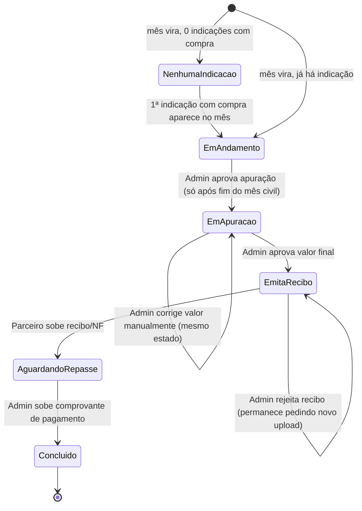

# Área de Parceiros — Plano de Implementação (v2.2 — APROVADO)

Status: **APROVADO pela Gestora em 2026-08-04 — pronto para a conta de execução iniciar a Fase 0.**
Escopo deste documento: análise de viabilidade + desenho técnico. Nenhum arquivo de produto
(`src/`, `scripts/`, `public/`) foi tocado para produzir este plano — só leitura.

Toca, por definição, itens do `CLAUDE.md` que exigem plano+aprovação prévia: identidade/sessão
(role novo), sistema de design (`JourneyNav`, menu), e um "god file" (`src/actions/journey.ts`,
`SurveyEngine`/`welcome-survey.ts`). Este documento é esse plano. `firestore.rules` acaba não
precisando de mudança (ver §2).

**v2 incorporou as decisões já tomadas pela Gestora** (ver §9 — todas as 6 perguntas em aberto da
v1 foram respondidas) e **v2.2 corrige o mecanismo de casamento evento↔checkpoint** (§5) para
refletir a Fase 3.3 real, entregue pela execução em 2026-08-04: casamento por identificador
mecânico (`CalendarEventType.atende`/`serviceCode`), não mais por texto/palavra-chave nem por
campo de corpo do evento. A captura de indicação (§4) reaproveita a pergunta **já existente**
"Como você nos conheceu?" da Welcome Survey, sem nenhum código/link novo.

---

## 0. Resumo executivo

Reaproveitamento real é alto: núcleo de acesso (`resolverAcesso`), `GlassModal`,
`ContractTermsCheckboxes`, padrão de consentimento (`User_Consent`), `FunctionalPageHeader`/
`StatTile`, os dois padrões de upload/download de documento, e a janela de agendamento (3–20 dias)
já existem prontos. Duas peças precisam de generalização real: `JourneyNav` (regras de negócio de
membro embutidas e não desligáveis) e a query de estágios (`getJourneyStagesAction`, hoje sem
filtro de audiência). Dois conceitos são novos: o vínculo indicador→indicado (agora simplificado —
é só uma resposta de survey, não um sistema de código/link) e o motor de ciclos de repasse.

Infra atual (Vercel Hobby + Firebase Spark) comporta o MVP — confirmado pela Gestora que o volume
inicial de parceiros é baixo, e a decisão de geração de ciclo por ação do Admin (não cron) elimina
o único ponto de atrito real com o plano Hobby.

Consultor e Parceiro são conceitos **distintos**, confirmado pela Gestora — este plano não
precisa reconciliar com `BUG-112`/networking; são áreas separadas por decisão de produto.

---

## 1. Estrutura de dados no Firestore

### 1.1 Em `User/{matricula}` (documento principal)

```
User/{matricula}/User_Permissions/access
  services.partner_area_access: boolean     // concedido via Admin, mesmo padrão de member_area_access
  partnerCommissionPercent?: number          // FIXO por parceiro (decisão da Gestora, §9.3) —
                                              // definido pelo Admin ao conceder acesso de parceiro,
                                              // não é negociado por indicação individual
```

Cadastral, dentro de `profile` (mesmo lugar de hoje) — inclui agora a seção de empresa pedida
pela Gestora:

```ts
profile.partnerType?: 'PF' | 'PJ'
profile.companyData?: {                 // só existe/exigido quando partnerType === 'PJ'
  cnpj: string                          // informativo, SEM trava de unicidade (decisão §9.6)
  razaoSocial: string
  nomeFantasia: string
  endereco: { cep, logradouro, numero, complemento?, bairro, cidade, uf }
}
```

`partnerType` decide qual seção o formulário mostra (PF: CPF já existente do cadastro geral / PJ:
seção "Dados da Empresa" acima) — reaproveita 100% o padrão de seção condicional já existente em
`src/config/forms/definitions/dados-cadastrais.ts` (`logic.showIf`), só adicionando uma seção
irmã. Sem novo motor de formulário.

### 1.2 Subcoleções novas sob `User/{matricula}` (herdam a regra catch-all existente — ver §3)

```
User/{matricula}/User_Journey/partner_progress
  // mesmo formato de UserStepProgress, doc IRMÃO de "progress" — evita colisão de stepId

User/{matricula}/Partner_Consent/current
User/{matricula}/Partner_Consent_History/{eventId}
  // mesmo padrão de src/actions/consent.ts, versão própria (PARTNER_TERMS_VERSION)

User/{matricula}/Partner_Referrals/{referredMatricula}
  {
    referredMatricula: string
    referredNome: string          // snapshot no momento da indicação
    cpfHash: string                // uso SERVER-ONLY (§9.1) — nunca retornado ao client
    dataIndicacao: Timestamp
    commissionPercent: number      // CÓPIA do partnerCommissionPercent no momento da indicação
                                    // (audita histórico — mudar a taxa do parceiro no futuro não
                                    // reescreve indicações já geradas)
    source: 'welcome_survey'       // registrado para auditoria — único mecanismo de captura hoje
  }
  // Campos DINÂMICOS (status da jornada, serviços adquiridos, valor, data de corte) NÃO ficam
  // aqui — resolvidos ao vivo por Server Action no momento da leitura (§1.4).

User/{matricula}/Partner_Billing_Cycles/{AAAA-MM}
  {
    cycleId: string                // = doc id, ex. "2026-08"
    monthYear: string
    totalIndications: number
    totalCommissionValue: number
    adjustedValue?: number         // correção manual do admin
    status: PartnerCycleStatus     // §4
    invoiceUpload?: { url, uploadedAt }
    paymentProof?: { url, uploadedAt, uploadedByAdmin }
    generatedAt: Timestamp
    lastRecalculatedAt: Timestamp
  }

User/{matricula}/Partner_Billing_Cycles/{AAAA-MM}/Comments/{commentId}
  { authorRole: 'partner' | 'admin', text: string, createdAt: Timestamp }
```

### 1.3 Diretório de parceiros (novo — para alimentar "Como você nos conheceu?")

```
Settings/PartnerDirectory
  entries: Array<{
    partnerMatricula: string
    displayName: string      // nome exibido na lista de opções da Welcome Survey
    active: boolean           // admin desativa sem apagar histórico
  }>
```

Gerenciado por uma tela nova do Admin (ou uma seção da tela de gestão de usuários existente) — ao
conceder `partner_area_access` a alguém, o Admin também adiciona/edita a entrada correspondente
aqui com o nome que deve aparecer para o cliente escolher.

### 1.4 Server Action de projeção (dado dinâmico da indicação)

`getPartnerIndicationsAction()` (mirror de `src/actions/networking.ts:48-198`):

1. Resolve a matrícula do CHAMADOR pela sessão verificada (nunca por parâmetro do client).
2. Confirma `services.partner_area_access === true`.
3. Lê `User/{matricula}/Partner_Referrals` (bounded — só os indicados deste parceiro).
4. Para cada `referredMatricula`, projeta campo a campo (Admin SDK) status da jornada e serviços
   adquiridos — só campos aprovados, tipados. O `cpfHash` nunca entra no retorno ao client.

---

## 2. `firestore.rules` — mudanças precisas

**Nenhuma mudança necessária.** Todas as subcoleções novas (§1.2) vivem sob `User/{matricula}` e
já são cobertas pela regra catch-all existente (dono-ou-admin, escrita só via Admin SDK). A
leitura cross-user (parceiro vendo indicados) é feita por Server Action com Admin SDK projetando
manualmente (§1.4) — nunca abrindo a regra para terceiros.

`Settings/PartnerDirectory` precisa de uma regra nova, mesmo padrão de qualquer outra `Settings/*`
já existente (leitura autenticada, escrita só Admin SDK).

---

## 3. Zustand — gerenciamento do toggle de contexto

Nova store dedicada (primeira store "de verdade" do projeto além do `tour-store`), com `persist`:

```ts
usePartnerContextStore: {
  activeContext: 'member' | 'partner'
  setActiveContext(ctx): void
}
// persist(..., { name: 'bplen_active_context' }) — localStorage
```

A store **nunca é a fonte de autorização** — só preferência de UI/roteamento. A fonte de verdade
de "o usuário PODE ver Parceiro" é `services.partner_area_access`, já disponível em tempo real no
client via `AuthContext` — o `HubHeader` só precisa passar a ler esse campo (hoje não lê) para
decidir se renderiza o toggle.

Páginas compartilhadas (Visão Geral, Networking, Meus Contratos, Perfil) leem `activeContext` só
para filtragem de UI (ocultar seções) — sem implicação de segurança, dado já carregado.

Rotas exclusivas de Parceiro protegidas no servidor, copiando o gate real existente:
```
src/app/hub/partners/layout.tsx   // igual a src/app/hub/membro/layout.tsx:27-43
  if (services?.partner_area_access !== true) redirect("/hub")
```

---

## 4. Captura da indicação — via Welcome Survey (decisão da Gestora, §9.4)

Mecanismo definitivo: **nenhum código/link novo.** A pergunta já existente `step_origin` /
campo `origin` ("Como você nos conheceu?", `src/config/surveys/welcome.ts:87-104`) ganha as opções
do `Settings/PartnerDirectory` (§1.3) somadas às opções fixas atuais (Instagram, LinkedIn, etc.).

Trabalho técnico necessário (pequeno, contido a um campo):
1. **Opções dinâmicas no `SurveyEngine`**: hoje `SurveyFieldConfig.options` é um array estático
   (TS puro). Precisa de uma pequena extensão — ou (a) o array de opções do campo `origin` é
   resolvido no servidor antes de montar o `SurveyConfig` enviado ao client (concatenando
   `PartnerDirectory.entries.filter(active).map(displayName)` às opções fixas), ou (b) o
   `SurveyEngine` ganha suporte a uma fonte de opções assíncrona por `fieldId`. A opção (a) é mais
   simples e não exige mudar o motor — resolvido uma vez, no carregamento da página da Welcome
   Survey.
2. **Efeito colateral no primeiro login**: `src/actions/effects/welcome-survey.ts` ganha um branch
   novo: se `origin` bater com um `displayName` do `PartnerDirectory`, resolve para
   `partnerMatricula` e cria `User/{partnerMatricula}/Partner_Referrals/{novoClienteMatricula}`
   (com `commissionPercent` copiado do parceiro, `source: 'welcome_survey'`). Se `origin` for
   qualquer outra opção (Instagram, "Indicação" genérica, etc.), comportamento é idêntico ao de
   hoje — nada muda.
3. Sem trava de duplicidade necessária além da natural (survey de boas-vindas roda uma vez por
   usuário, já garantido pelo gate `hasCompletedWelcomeSurvey` existente).

---

## 5. Reunião de Onboarding ↔ Google Calendar — resolvido (mecanismo atual, pós-Fase 3.3)

**Segunda correção (a primeira, na v2.1, já estava desatualizada):** a execução entregou HOJE
(2026-08-04, mesmo dia deste plano) a Fase 3.3 real da migração de tipos de evento
(`docs/system-audit/LOG.md`, entradas de 2026-08-03/04). O casamento evento↔parada **não é mais
por texto nem por palavra-chave** — passou a ser por **identificador mecânico**, exatamente como
você descreveu:

- `Settings/CalendarEventTypes` — cada tipo declara `atende: string[]` (quais `serviceCode`s ele
  serve) — `src/types/calendar-event-types.ts:18-39`.
- `slotServesStage()` (`src/lib/calendar/slot-offer.ts:40-49`) decide se um slot livre atende uma
  etapa checando `tipo.atende.includes(serviceCode)`.
- `bookingMatchesSubstep()` (`src/lib/journey/booking-match.ts:61-71`) decide se um agendamento
  JÁ CONFIRMADO pertence à parada, com precedência total para o `subStepId` gravado no momento do
  booking — texto (`meeting-keyword.ts`) agora é só fallback para agendamento anterior a esta fase.

"Onboarding de Parceiros" já existe no Google Calendar e foi **deliberadamente mantido fora** dos
5 tipos migrados (confirmado no LOG: *"'Onboarding de Parceiros' continua fora por não ser jornada
de membro"*) — hoje esse evento não tem `tipoId`. Para casar automaticamente com o checkpoint da
jornada de parceiro, faltam só dois passos, **nenhum deles código**:

1. **Adicionar um 6º `CalendarEventType`** pela tela de admin já existente (ex. `id:
   "onboarding-parceiro"`, `googleTitle: "Onboarding de Parceiros"`, `atende: [<serviceCode do
   checkpoint>]`) — não há validação de "exatamente 5 tipos" no código
   (`src/actions/calendar-event-types.ts:41,47,58`), os 5 são só o seed inicial se a config
   estiver vazia.
2. **Dar ao checkpoint "Reunião de Onboarding" o `serviceCode` correspondente** — mesma
   configuração de qualquer outro checkpoint, feita na aba Atributos do produto/portfolio.

Com isso o casamento é automático pela MESMA lógica mecânica que já resolve todos os outros
checkpoints hoje. Único ponto de atenção: a lista de 5 tipos é tratada como "fechada" por decisão
explícita da Gestora (revisão de 2026-08-03, `AGENDA-SYNC-DESIGN.md` §8.10) — estendê-la para 6 é
uma decisão dela a ratificar, mas puramente operacional (ação na tela de admin), não uma tarefa de
código da Fase 2 deste plano.

---

## 6. Gestão de Indicações — mapa de fluxo dos status do ciclo



- `NenhumaIndicacao`/`EmAndamento` calculados automaticamente (idempotente).
- Única barreira temporal real: não fechar o mês corrente antes do fim dele.
- Geração/atualização do ciclo: ação do Admin ("Gerar/Atualizar Ciclo"), idempotente — recalcula
  sempre a partir de `Partner_Referrals`, nunca acumula. Sem cron novo (confirmado infra §0).

---

## 7. Segurança/governança adotadas neste plano

1. **`cpfHash` nunca é retornado ao client** (confirmado, §9.1) — uso server-only, evita indicação
   duplicada do mesmo CPF por parceiros diferentes.
2. **Toda Server Action de parceiro resolve identidade pela sessão verificada**, nunca por
   parâmetro do client (Lição 44 do `RETROSPECTIVE.md`).
3. **`firestore.rules` não é alterada** — superfície de auditoria deste plano fica em zero mudança
   de regra.
4. Consultor e Parceiro são áreas distintas (confirmado) — sem risco de sistema de papel duplicado.

---

## 8. Arquivos legados tocados, por subsistema

| Subsistema | Arquivo(s) | Mudança | Risco / mitigação |
|---|---|---|---|
| Jornada (query de estágios) | `src/actions/journey.ts` (`getJourneyStagesAction`) | Filtrar por `targetAudiences` quando `journeyType==='partner'` | Aditivo, default de membro inalterado |
| Jornada (doc de progresso) | mesmo arquivo | Usar doc irmão `partner_progress` | Zero risco ao membro |
| Jornada (nav/topo) | `src/components/journey/JourneyNav.tsx` | Prop `variant?: 'member'\|'partner'` desliga upsell/sequence-lock/gate onboarding-offboarding hardcoded | Sem prop, comportamento de membro idêntico |
| Jornada (fallback de acesso) | `src/hooks/useJourney.ts:223-240` | Nenhuma mudança SE checkpoints de parceiro nascerem com `serviceCode`+`preRequisitos` | Garantir no cadastro do produto/checkpoint |
| Rotas/páginas de jornada | `src/app/hub/journey/{page,layout}.tsx` | Duplicar como `src/app/hub/partners/journey/{page,layout}.tsx` | Cópia paramétrica intencional — sincronizar em fixes futuros |
| Menu sanduíche | `src/components/hub/HubHeader.tsx` (`menuSections`) | Ler `services` de `useAuthContext()` + seção "Parceiro" condicional + toggle | Aditivo |
| Agenda/booking | `src/actions/calendar-module/booking.ts` | Pular bloco de cota e de estorno/penalidade para `tipoId` de parceiro | Blocos já isolados — adicionar condição |
| Agenda/tipo de evento | `Settings/CalendarEventTypes` + `src/lib/booking/policy.ts` | Novo `tipoId` (`"parceiro"`, sessões livres) + 6º tipo `"onboarding-parceiro"` (§5) | Sem código — ação de admin na tela existente; `atende` isola de todos os outros tipos |
| Agenda/onboarding parceiro | nenhum arquivo — só config (`Settings/CalendarEventTypes` + `serviceCode` do checkpoint) | Casamento automático via `slotServesStage`/`bookingMatchesSubstep`, mecanismo já genérico pós-Fase 3.3 (§5) | Zero risco de colisão — identificador, não texto |
| Agenda/motivo da sessão | `src/components/ui/Calendar.tsx:473` | Trocar `.includes("1 to 1")` por checagem de `tipoId` | Já é melhoria da própria migração em andamento |
| Welcome Survey (opção nova) | `src/config/surveys/welcome.ts` | Nova opção "Parceria de Negócios" em `step_type` + `logic` | Aditivo |
| Welcome Survey (origem dinâmica) | `src/config/surveys/welcome.ts` / carregamento server-side | Opções de `origin` somam `PartnerDirectory` (§4) | Contido a 1 campo |
| Classificação PF/PJ | `src/actions/effects/welcome-survey.ts:32-33` | Reconhecer nova opção de `userType` | Obrigatório — hoje cairia silenciosamente em "PF" |
| Efeito de indicação | `src/actions/effects/welcome-survey.ts` | Novo branch: `origin` bate com parceiro → cria `Partner_Referrals` | Novo, aditivo |
| Cadastro (dados da empresa) | `src/config/forms/definitions/dados-cadastrais.ts` | Nova seção condicional "Dados da Empresa" (PJ) | Reaproveita `logic.showIf` já existente |
| Registro de survey no Drive | `src/lib/survey/survey-serializer.ts` (branch `feat/drive-coverage-surveys`, não mergeado) | Nenhuma mudança — survey novo já ganha registro automático | Depende do merge dessa branch antes da Fase de Check-in |
| Contrato (Formalização de Parceria) | `src/lib/contract-content.ts`, `src/components/contracts/*` | Implementar generalização por audiência já prevista (`CONTRACTS-DESIGN.md` §10, CT-3c) | Próximo passo natural do próprio design, não desvio |
| Home do parceiro | `src/components/hub/HubHomeView.tsx` | Copiar estrutura para `PartnerHomeView.tsx` | Cópia, seções próprias de parceiro |

---

## 9. Decisões já confirmadas pela Gestora

1. **HashCPF**: uso interno BPlen apenas, nunca exposto na UI do parceiro. ✅ Adotado (§1.2, §7).
2. **Geração de ciclo mensal**: por ação do Admin, não cron automático. ✅ Adotado (§6).
3. **Comissão**: **fixa por parceiro** (não por indicação, não negociada caso a caso). ✅ Adotado
   (`partnerCommissionPercent` em `User_Permissions/access`, §1.1).
4. **Captura da indicação**: **nenhum código/link** — o próprio usuário seleciona quem o indicou
   na Welcome Survey, reaproveitando a pergunta "Como você nos conheceu?" já existente. ✅ Adotado
   (§4) — simplifica bastante a Fase 3 frente à v1 deste documento.
5. **Consultor ≠ Parceiro**: conceitos distintos, Consultor terá área própria no futuro, fora do
   escopo deste pedido. ✅ Confirmado, sem ação necessária aqui.
6. **CNPJ**: campo informativo, sem trava de unicidade. ✅ Adotado (§1.1).
7. **Infra**: volume inicial de parceiros baixo — Gestora concorda que não deve pressionar a cota
   Spark/cron Hobby de forma relevante. ✅ Confirmado.
8. **Novo escopo incorporado**: seção de cadastro de empresa (razão social, fantasia, endereço) +
   seleção de tipo de parceria PF/CPF ou PJ/CNPJ. ✅ Incorporado (§1.1) — reaproveita o padrão de
   seção condicional já existente no motor de formulários, risco operacional baixo.

---

## 10. Arquitetura de pastas proposta

```
src/app/hub/partners/
  page.tsx                         // Home do Parceiro
  layout.tsx                       // gate services.partner_area_access
  journey/[stepId]/page.tsx        // Jornada do Parceiro
  gestao_agenda/page.tsx
  gestao_indicacoes/page.tsx

src/components/hub/partners/
  PartnerHomeView.tsx
  PartnerIndicationsTable.tsx
  PartnerBillingCyclesPanel.tsx
  PartnerTermsSigningModal.tsx     // GlassModal + ContractTermsCheckboxes

src/actions/partners/
  referrals.ts        // getPartnerIndicationsAction
  billing-cycles.ts   // generateOrUpdateCycleAction (admin-triggered), uploadInvoiceAction
  partner-consent.ts  // mirror de consent.ts, versão própria
  directory.ts         // gerencia Settings/PartnerDirectory (admin)

src/types/partners.ts
  // Zod: PartnerReferralSchema, PartnerBillingCycleSchema, PartnerCycleStatus enum,
  // CompanyDataSchema

src/lib/partners/
  cycle-status.ts      // state machine pura (§6), testável
  commission.ts         // cálculo de valor a partir de partnerCommissionPercent

src/config/surveys/definitions/partner-checkin.ts
src/config/forms/definitions/partner-dados-cadastrais.ts   // inclui seção "Dados da Empresa"

src/app/admin/partners-program/
  page.tsx   // PartnerDirectory + aprovação de ciclos + toggle partner_area_access + taxa fixa
```

---

## 11. Fases de execução propostas (cada uma = branch + PR próprios)

- **Fase 0 — Fundamentos**: flag `partner_area_access` + `partnerCommissionPercent` + gate de rota
  + toggle Zustand + `HubHeader` condicional.
- **Fase 1 — Jornada do Parceiro**: checkpoints 2-3 e 5-6 (Boas-vindas por último, conforme
  pedido). Generalização mínima de `JourneyNav`/query de estágios.
- **Fase 2 — Agenda do Parceiro**: `tipoId`/6º `CalendarEventType` novo (config de admin, §5) +
  branch sem cota.
- **Fase 3 — Captura de indicação + Gestão de Indicações**: opções dinâmicas em `origin` +
  `PartnerDirectory` + branch em `welcome-survey.ts` + action de projeção + UI.
- **Fase 4 — Ciclos de Repasse**: state machine, upload/download, painel admin de aprovação.
- **Fase 5 — Home do Parceiro + polimento**: seção Boas-vindas/tourguide, pop-up único.

---

*Aprovado pela Gestora em 2026-08-04. Única ratificação operacional pendente (não bloqueia a Fase
0): estender a lista fechada de `CalendarEventTypes` de 5 para 6 tipos, quando a Fase 2 chegar
(§5). A conta de execução pode abrir a Fase 0 a partir deste documento.*
